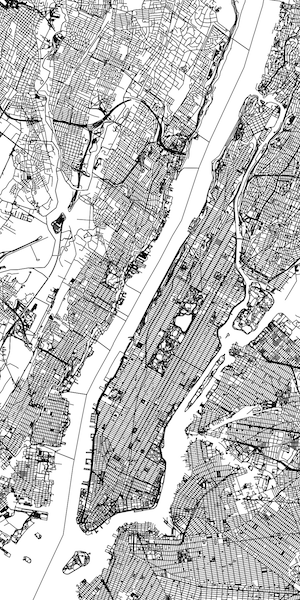

# Render NYC from OpenStreetMap data



This repo walks through how to use OSM data to render a high-quality raster image of Manhattan on Mac OS X. It's a bit more complex than you might expect. This is the guide I wish I'd had when I started. It can easily be adapted to different cities -- I just like concrete examples :)

There are two main components:

1) A Postgres database with OSM database open on Mac OS.
2) A Mapnik Python script that runs in a Docker container.

For (2), conceivably you could install Mapnik directly onto Mac OS instead, but I couldn't figure it out.

## Setup

### Component 1: Postgres database with OSM data

You'll need PostgreSQL with PostGIS extensions. One approach: install [postgres.app](http://postgresapp.com/) and (optionally, for easy data exploration) [PSequel](http://www.psequel.com/).

Download `NewYork.osm.pbf` from http://download.bbbike.org/osm/bbbike/NewYork.

Install [osm2pgsql](https://wiki.openstreetmap.org/wiki/Osm2pgsql):

```sh
> brew install osm2pgsql
```

Create a database (here it's called `osm_nyc`, but choose whatever):

```sh
> createdb osm_nyc
> psql -d osm_nyc -c 'CREATE EXTENSION postgis; CREATE EXTENSION hstore;'
```

Load the NYC OSM data into the database:

```sh
> osm2pgsql --create --database osm_nyc NewYork.osm.pbf
```

### Component 2: Python Mapnik in a Docker container

Clone this repo:

```sh
> git clone git@github.com:maxh/render-nyc.git
```

Install [Docker](https://www.docker.com/get-docker). Build the image:

```sh
> cd render-nyc/
> docker build . -t render_nyc
```

Per the `Dockerfile`, this image will have both Mapnik and its Python bindings installed. Now create (but don't start) a container:

```sh
docker create --name render_nyc -it render_nyc bash
```

## Usage

### Render one time

```sh
> docker start render_nyc
> docker exec render_nyc python2 /opt/render_nyc.py
> docker cp render_nyc:/nyc.png ./
> open -a Preview ./nyc.png
> docker stop render_nyc
```

### Tweak code and rerender

#### Set up

```sh
> docker start render_nyc
```

#### Iterate

Edit `render_nyc.py` by tweaking e.g. the style, database query, or viewport. Then run these commands to execute the new script on the Docker container:

```sh
# Split up for readability:
> docker cp ./render_nyc.py render_nyc:/opt/
> docker exec render_nyc python2 /opt/render_nyc.py
> docker cp render_nyc:/nyc.png ./

# Run one line with `&&` for quick build cycles.
> docker cp ./render_nyc.py render_nyc:/opt/ && docker exec render_nyc python2 /opt/render_nyc.py && docker cp render_nyc:/nyc.png ./
```

Open the output image:

```sh
> open -a Preview ./nyc.png
```

Preview will automatically refresh when the file on disk changes (unless you've edited it within Preview).

#### Cleanup

```sh
> docker stop render_nyc
```

____Random dev notes____

After editing Dockerfile

Remove exited containers: `docker rm $(docker ps -a -f status=exited -q)`
Remove unused images: `docker rmi image-name-1 image-name-2`
